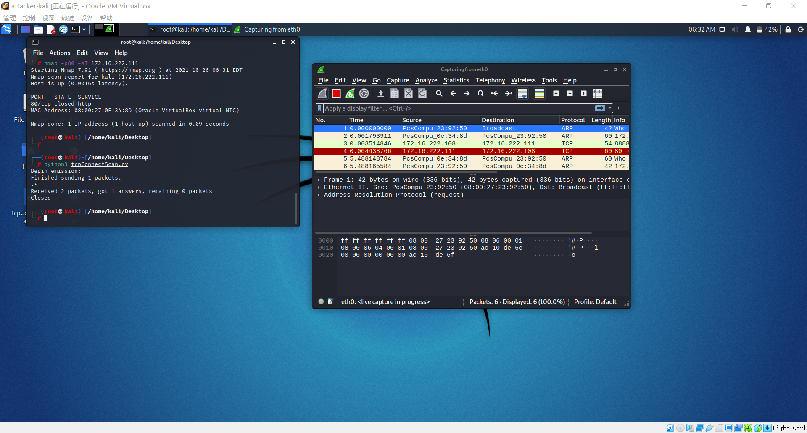

# 实验五:基于 Scapy 编写端口扫描器
## 实验目的
- 掌握网络扫描之端口状态探测的基本原理 
## 实验环境
- python + scapy
- 攻击者主机(attacker-kali):Kali-Linux eth0:176.16.222.108
- 靶机(Victim-kali):Kali-Linux eth0:176.16.222.111
- 网关(gateway):Debian enp0s10:176.16.222.1
## 实验要求
- [x] 完成以下扫描任务的编程实现
	- TCP connect scan / TCP stealth scan
	- TCP Xmas scan / TCP fin scan / TCP null scan
	- UDP scan
- [x] 上述每种扫描技术的实现测试均需要测试端口状态为：`开放`、`关闭`和`过滤`状态时的程序执行结果
- [x] 提供每一次扫描测试的抓包结果并分析与课本中的扫描方法原理是否相符？如果不同，试分析原因
- [x] 在实验报告中详细说明实验网络环境拓扑、被测试 IP 的端口状态是如何模拟的
- [x] （可选）复刻`nmap`的上述扫描技术实现的命令行参数开关
## 实验原理

### 扫描原理

`TCP connect scan` 与`TCP stealth scan`都是先发送一个SYN数据包到目标主机的特定端口上，如果没有回应则属处于过滤状态；如果接收到RSN/ACK数据包，端口是关闭状态；如果接收到SYN/ACK数据包，说明端口是开发状态，这时：

- `TCPconnect scan`会回复一个RST/ACK数据包，完成三次握手后断开连接
- `TCP stealth scan`只回复一个RST，不完成三次握手，直接取消建立连接

`TCP Xmas scan`、`TCP fin scan` 和`TCP null scan`都属于隐蔽扫描，他们的优点是隐蔽性比较好，缺点是需要自己构造数据包，要求有超级用户或者授权用户权限。

他们都是先发送一个包，端口关闭则回复RST，端口开放或过滤则没有任何相应。其中：

- `TCP Xmas scan`发的是TCP包，并对TCP报文头FIN\URG和PUSH进行设置。
- `TCP fin scan`发的是FIN包
- `TCP null scan`发送TCP数据包，关闭所有TCP报文头标记

UDP是无连接的协议，通过发送UDP+port得到靶机状态

- 如果收到一个 ICMP 不可到达的回应，那么则认为这个端口是关闭的

- 对于没有回应的端口则认为是开放的

- 如果目标主机安装有防火墙或其它可以过滤数据包的软硬件,那我们发出 UDP 数据包后,将可能得不到任何回应。

  ### scapy原理

  ```
  # 导入模块
  from scapy.all import *
  # 查看包信息
  pkt = IP(dst="")
  ls(pkt)
  pkt.show()
  summary(pkt)
  # 发送数据包
  send(pkt)  # 发送第三层数据包，但不会受到返回的结果。
  sr(pkt)  # 发送第三层数据包，返回两个结果，分别是接收到响应的数据包和未收到响应的数据包。
  sr1(pkt)  # 发送第三层数据包，仅仅返回接收到响应的数据包。
  sendp(pkt)  # 发送第二层数据包。
  srp(pkt)  # 发送第二层数据包，并等待响应。
  srp1(pkt)  # 发送第二层数据包，并返回响应的数据包
  # 监听网卡
  sniff(iface="wlan1",count=100,filter="tcp")
  # 应用：简单的SYN端口扫描 （测试中）
  pkt = IP("...")/TCP(dport=[n for n in range(22, 3389)], flags="S")
  ans, uans = sr(pkt)
  ans.summary() # flag为SA表示开放，RA表示关闭
  ```

  

## 实验过程

### 端口状态模拟

- `Open`状态

  ```
  # 开启apache服务，以启用端口80
  service apache2 start
  
  #开启dnsmasq服务，以启用端口53
  apt-get install dnsmasq
  service dnsmasq start
  
  # 查看开启状态
  netstat -ntulp | grep 80 
  ```

- `Close`状态

  ```
  # 关闭apache服务，以关闭端口80
  service apache2 stop
  
  # 查看80端口对应的进程
  lsof -i:80
  ```

- `Filtered`状态

  ```
  # 安装 ufw 防火墙（Kali 2019 没有自带防火墙）
  apt-get install ufw 
  
  # 查看防火墙状态（默认 inactive）
  ufw status
  
  # 开启apache服务的同时开启防火墙，模拟filtered状态
  ufw enable
  
  # 关闭防火墙
  ufw disable
  ```

### 1 TCP Connect Scan

#### 1.1 code

```python

#! /usr/bin/python
import logging
logging.getLogger("scapy.runtime").setLevel(logging.ERROR)
from scapy.all import *

dst_ip = "172.16.222.111"
client_port = 8888
dst_port=80

tcp_connect_scan_resp = sr1(IP(dst=dst_ip)/TCP(sport = client_port,dport = dst_port,flags = "S"),timeout = 10)

if(tcp_connect_scan_resp==None):
    print("Flitered")
elif(tcp_connect_scan_resp.haslayer(TCP)):
    if(tcp_connect_scan_resp.getlayer(TCP).flags==0x12):
        send_rst = sr1(IP(dst=dst_ip)/TCP(sport = client_port,dport = dst_port,flags=0x14),timeout = 10)
        print("Open")
    elif(tcp_connect_scan_resp.getlayer(TCP).flags==0x14):
        print("Closed")
```

#### 1.2 测试开放端口

- 扫描过程

  - scapy扫描

    
	
  - `nmap` 扫描 (`nmap -p80 -sT 172.16.222.111`)
	
	

#### 1.3 关闭测试端口

- 扫描过程

	- `scapy`扫描
	
	  
	
	- `nmap`扫描


#### 1.4 测试过滤窗口
- 扫描过程

	- `scapy`扫描
	
	  
	
	- `nmap`扫描


### 2 TCP stealth scan

#### 2.1 code

```python
#! /usr/bin/python

import logging
logging.getLogger("scapy.runtime").setLevel(logging.ERROR)
from scapy.all import *

dst_ip = "172.16.222.111"
src_port = 8888
dst_port = 80

stealth_scan_resp = sr1(IP(dst=dst_ip)/TCP(sport=src_port,dport=dst_port,flags="S"),timeout=10)
if(stealth_scan_resp==None):
    print ("filtered: no response")
elif(stealth_scan_resp.getlayer(TCP)):
    if(stealth_scan_resp.getlayer(TCP).flags==0x12):
        send_rst=sr(IP(dst=dst_ip)/TCP(sport=src_port,dport=dst_port,flags="R"),timeout=10)
        print ("open")
    elif(stealth_scan_resp.getlayer(TCP).flags==0x14):
        print ("closed")
    elif(stealth_scan_resp.haslayer(ICMP)):
        if(int(stealth_scan_resp.getlayer(ICMP).type)==3 and int(stealth_scan_resp.getlayer(ICMP).code) in [1,2,3,9,10,13]):
            print ("filtered: receive ICMP but destination inreachable")
```

#### 2.2 测试开放端口

- 扫描过程

  - scapy扫描

    
	
  - `nmap` 扫描 (`nmap -sS -p80 172.16.222.111`)
	

#### 2.3 关闭测试端口

- 扫描过程

	- `scapy`扫描
	
	  
	
	- `nmap`扫描


#### 2.4 测试过滤端口
- 扫描过程

	- `scapy`扫描
	
	  
	
	- `nmap`扫描


### 3 TCP Xmas scan

#### 3.1 code

```python
#! /usr/bin/python
 
import logging
logging.getLogger("scapy.runtime").setLevel(logging.ERROR)
from scapy.all import *
 
dst_ip = "172.16.222.111"
src_port = 8888
dst_port=80
 
xmas_scan_resp = sr1(IP(dst=dst_ip)/TCP(dport=dst_port,flags="FPU"),timeout=10)
if (xmas_scan_resp==None):
    print ("Open|Filtered")
elif(xmas_scan_resp.haslayer(TCP)):
    if(xmas_scan_resp.getlayer(TCP).flags == 0x14):
        print ("Closed")
elif(xmas_scan_resp.haslayer(ICMP)):
    if(int(xmas_scan_resp.getlayer(ICMP).type)==3 and int(xmas_scan_resp.getlayer(ICMP).code) in [1,2,3,9,10,13]):
        print ("Filtered")
```

#### 3.2 测试开放端口
- 扫描过程

  - scapy扫描

    
	
  - `nmap` 扫描 (`nmap -p80 -sX 172.16.222.111`)
	

#### 3.3 测试关闭端口

- 扫描过程

	- `scapy`扫描
	
	  
	
	- `nmap`扫描
	
	  

#### 3.4 测试过滤端口
- 扫描过程

	- `scapy`扫描
	
	  
	
	- `nmap`扫描
	
	

### 4  TCP fin scan

#### 4.1 code

```python
#! /usr/bin/python
 
import logging
logging.getLogger("scapy.runtime").setLevel(logging.ERROR)
from scapy.all import *
 
dst_ip = "172.16.222.111"
src_port = 8888
dst_port=80
 
fin_scan_resp = sr1(IP(dst=dst_ip)/TCP(dport=dst_port,flags="F"),timeout=10)
if (fin_scan_resp==None):
    print ("Open | Filtered | Closed")
elif(fin_scan_resp.haslayer(TCP)):
    if(fin_scan_resp.getlayer(TCP).flags == 0x14):
        print ("Closed")
elif(fin_scan_resp.haslayer(ICMP)):
    if(int(fin_scan_resp.getlayer(ICMP).type)==3 and int(fin_scan_resp.getlayer(ICMP).code) in [1,2,3,9,10,13]):
        print ("Filtered")
```


#### 4.2 测试开放端口
 - scapy扫描

    
	
  - `nmap` 扫描 (`nmap -sF -p80 172.16.222.111`)
	

#### 4.3 测试关闭端口
- 扫描过程

	- `scapy`扫描
	
	  
	
	- `nmap`扫描
	
	  

#### 4.4 测试过滤端口
- 扫描过程

	- `scapy`扫描
	
	  
	
	- `nmap`扫描
	
	
	
	

### 5 TCP null scan

#### 5.1 code

```python

#! /usr/bin/python
 
import logging
logging.getLogger("scapy.runtime").setLevel(logging.ERROR)
from scapy.all import *
 
dst_ip = "172.16.222.111"
src_port = 8888
dst_port=80
 
null_scan_resp = sr1(IP(dst=dst_ip)/TCP(dport=dst_port,flags=""),timeout=10)
if (null_scan_resp==None):
    print ("Open|Filtered|Closed")
elif(null_scan_resp.haslayer(TCP)):
    if(null_scan_resp.getlayer(TCP).flags == 0x14):
        print ("Closed")
elif(null_scan_resp.haslayer(ICMP)):
    if(int(null_scan_resp.getlayer(ICMP).type)==3 and int(null_scan_resp.getlayer(ICMP).code) in [1,2,3,9,10,13]):
        print ("Filtered")
```


#### 5.2 测试开放端口
 - scapy扫描

    
	
  - `nmap` 扫描 (`nmap -sN 172.16.222.111`)
	
#### 5.3 测试关闭端口
- 扫描过程

	- `scapy`扫描
	
	  
	
	- `nmap`扫描
	
	  

#### 5.4 测试过滤端口
- 扫描过程

	- `scapy`扫描
	
	  
	
	- `nmap`扫描
	
	
### 6 UDP scan

#### 6.1 code

```python
#!/usr/bin/python
import logging
logging.getLogger("scapy.runtime").setLevel(logging.ERROR)
from scapy.all import*

dst_ip = "172.16.222.111"
src_port = 8888
dst_port = 53

udp_scan_resp=sr1(IP(dst=dst_ip)/UDP(dport=dst_port),timeout=5,verbose=0)
if(udp_scan_resp==None):
    print("open | filtered | closed")
elif(udp_scan_resp.haslayer(ICMP)):
    if(udp_scan_resp.getlayer(ICMP).type==3 and udp_scan_resp.getlayer(ICMP).code==3):
        print("closed")
```


#### 6.2 测试开放端口
 - scapy扫描

    
	
  - `nmap` 扫描 (`nmap -sU -p53 172.16.222.111`)
	
#### 6.3 测试关闭端口
- 扫描过程

	- `scapy`扫描
	
	  
	
	- `nmap`扫描
	
	  

#### 6.4 测试过滤端口
- 扫描过程

	- `scapy`扫描
	
	  
	
	- `nmap`扫描
	
	

## 参考资料

[第五章实验](https://c4pr1c3.github.io/cuc-ns/chap0x05/exp.html)

[同学的实验报告](https://github.com/CUCCS/2021-ns-public-dongdongtay/tree/chap0x05/chap0x05)

[nmap端口扫描](https://nmap.org/man/zh/man-port-scanning-techniques.html)

