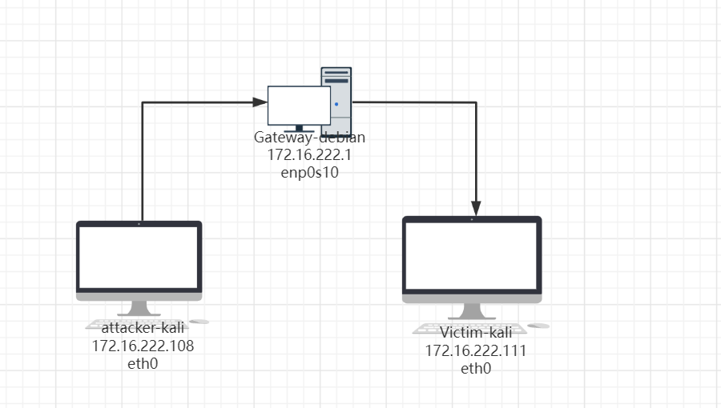
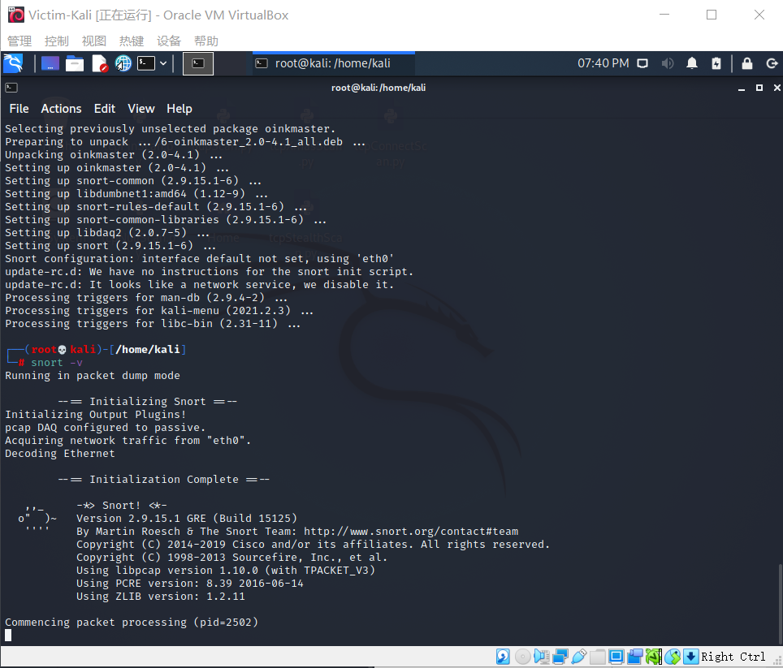
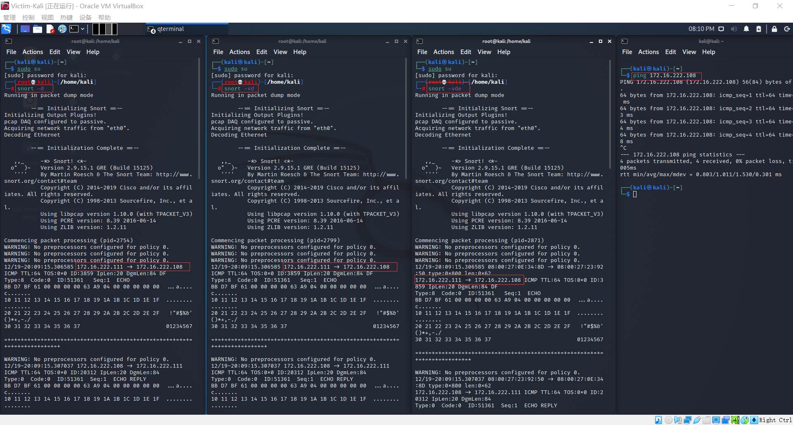
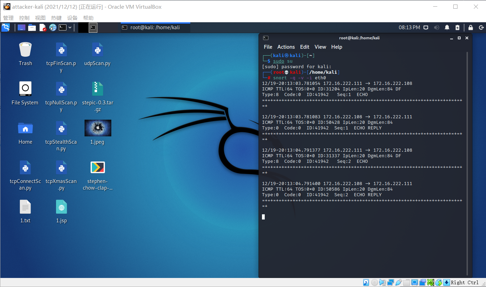
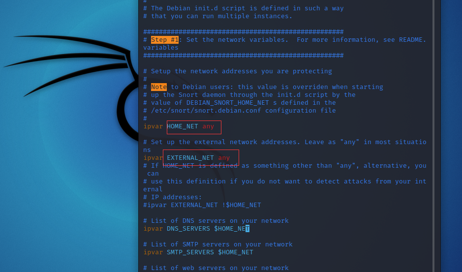
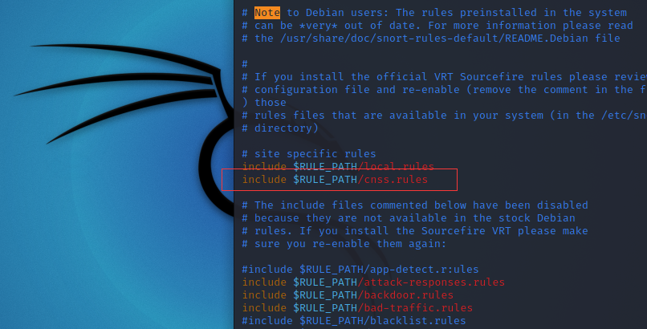
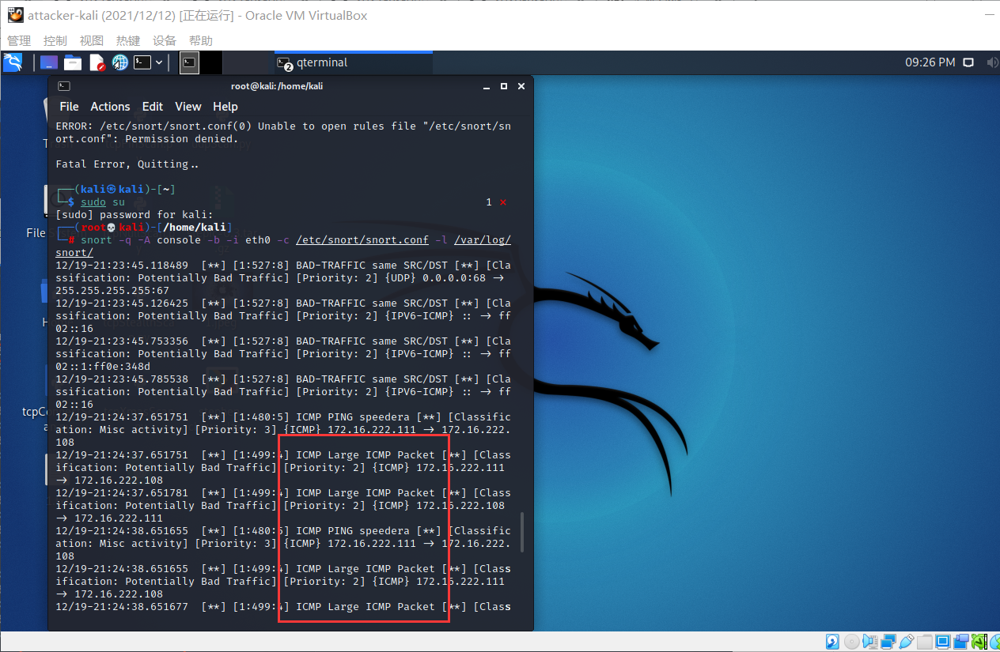
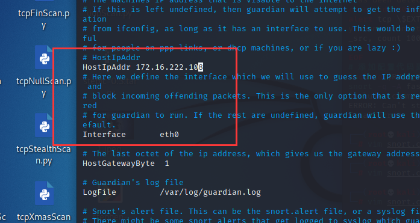
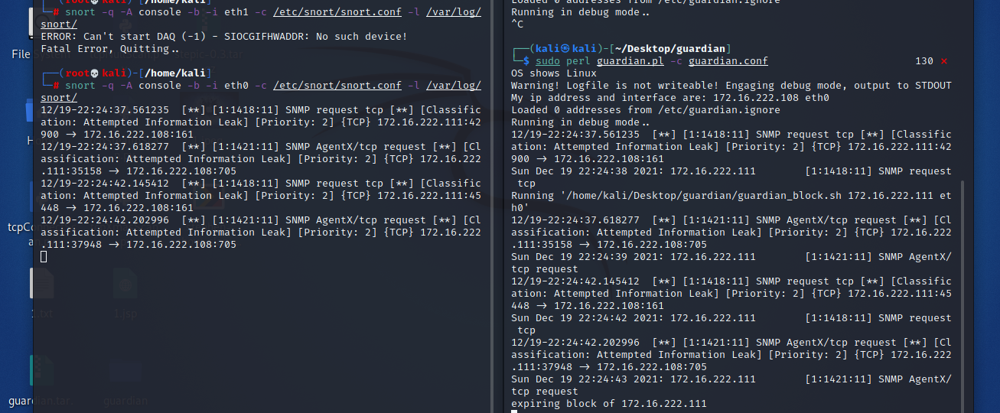

# 实验九:入侵检测
## 实验环境
- Victim-kali(172.16.222.111)
- attacker-kali(172.16.222.108)
## 网络拓扑


## 实验过程

### snort 安装
```
# 禁止在apt安装时弹出交互式配置界面
export DEBIAN_FRONTEND=noninteractive

apt install snort
```


### 实验一:配置snort为嗅探模式
```
# 显示IP/TCP/UDP/ICMP头
snort –v

# 显示应用层数据
snort -vd

# 显示数据链路层报文头
snort -vde

# -b 参数表示报文存储格式为 tcpdump 格式文件
# -q 静默操作，不显示版本欢迎信息和初始化信息
snort -q -v -b -i eth1 "port not 22"

# 使用 CTRL-C 退出嗅探模式
# 嗅探到的数据包会保存在 /var/log/snort/snort.log.<epoch timestamp>
# 其中<epoch timestamp>为抓包开始时间的UNIX Epoch Time格式串
# 可以通过命令 date -d @<epoch timestamp> 转换时间为人类可读格式
# exampel: date -d @1511870195 转换时间为人类可读格式
# 上述命令用tshark等价实现如下：
tshark -i eth1 -f "port not 22" -w 1_tshark.pcap
```
使用`victim-kali` ping `attacker-kali` 结果如下


### 实验二:配置并启用snort内置规则
```
# /etc/snort/snort.conf 中的 HOME_NET 和 EXTERNAL_NET 需要正确定义
# 例如，学习实验目的，可以将上述两个变量值均设置为 any
snort -q -A console -b -i eth0 -c /etc/snort/snort.conf -l /var/log/snort/
```


### 实验三:自定义snort规则
```
# 新建自定义 snort 规则文件
cat << EOF > /etc/snort/rules/cnss.rules

#INSERT
alert tcp \$EXTERNAL_NET any -> \$HTTP_SERVERS 80 (msg:"Access Violation has been detected on /etc/passwd ";flags: A+; content:"/etc/passwd"; nocase;sid:1000001; rev:1;)
alert tcp \$EXTERNAL_NET any -> \$HTTP_SERVERS 80 (msg:"Possible too many connections toward my http server"; threshold:type threshold, track by_src, count 100, seconds 2; classtype:attempted-dos; sid:1000002; rev:1;)
EOF

# 添加配置代码到 /etc/snort/snort.conf
include $RULE_PATH/cnss.rules

# 开启apache2
service apache2 start

#应用规则开启嗅探
snort -q -A fast -b -i eth0 -c /etc/snort/snort.conf -l /var/log/snort/

```


### 实验四:和防火墙联动

```
# 解压缩 Guardian-1.7.tar.gz
tar zxf guardian.tar.gz

# 安装 Guardian 的依赖 lib
apt install libperl4-corelibs-perl
```
在`attacker-kali`上先后开启`snort`和`guardian.pl`
```
snort -q -A fast -b -i eth1 -c /etc/snort/snort.conf -l /var/log/snort/
```
```
cd /home/kali/Desktop/guardian
```

编辑 guardian.conf 并保存，确认以下2个参数的配置符合主机的实际环境参数
```
HostIpAddr 172.16.222.108
Interface eth0
```

```
# 启动 guardian.pl
perl guardian.pl -c guardian.conf
```
在victim-kali 上用 nmap 暴力扫描 attacker-kali：
```
nmap 172.16.222.108 -A -T4 -n -vv
```

## 课后思考题
- IDS与防火墙的联动防御方式相比IPS方式防御存在哪些缺陷？是否存在相比较而言的优势？
    - 入侵检测系统（IDS）和入侵防御系统（IPS）都是网络基础架构的一部分。IDS / IPS将网络数据包与包含已知网络攻击签名的网络威胁数据库进行比较-并标记任何匹配的数据包。
    - IDS偏向于检测，属于管理系统，会检测出不安全的网络行为，但是不阻断任何网络行为。IPS偏向于防御，属于控制系统，可以阻止危险行为。
## 参考资料
- [第九章实验指南](https://c4pr1c3.gitee.io/cuc-ns/chap0x09/exp.html)
